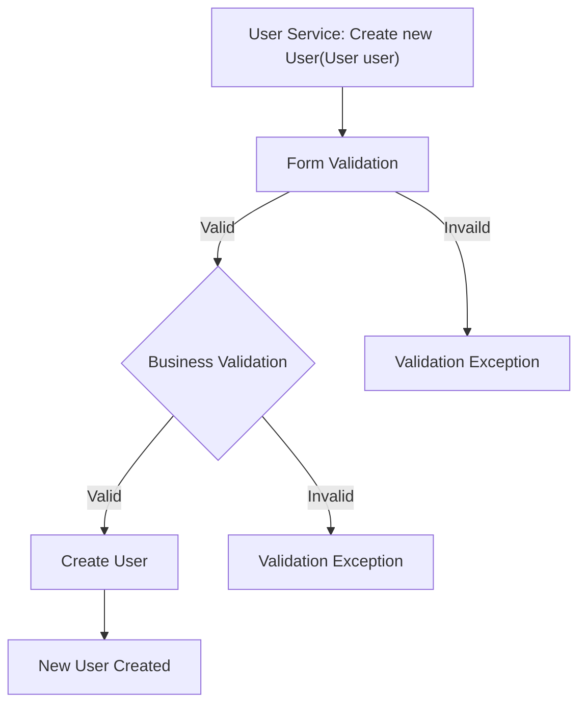
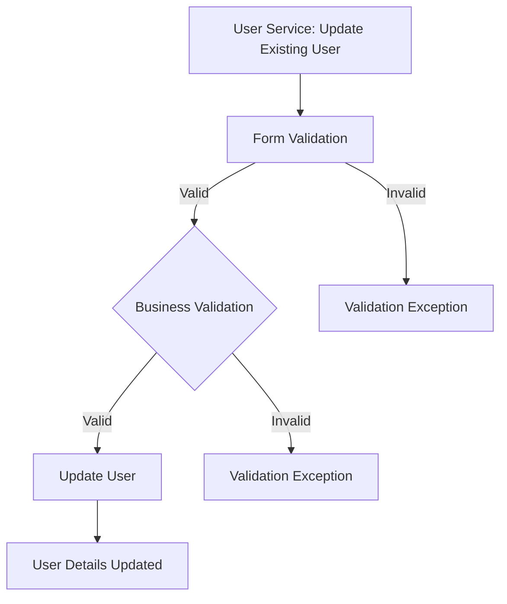
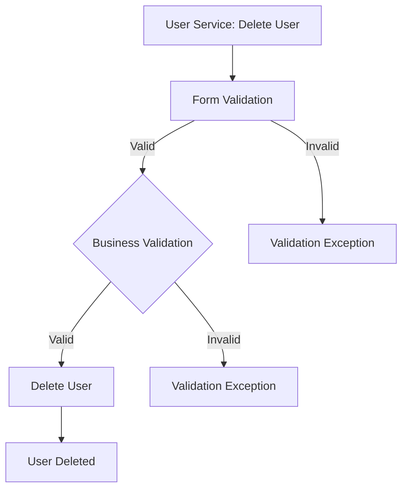
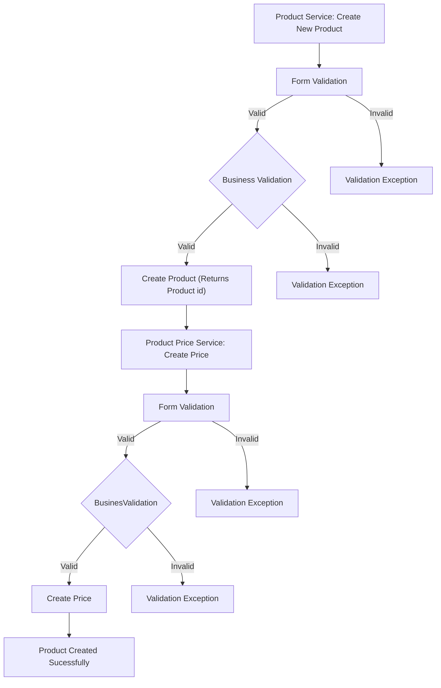
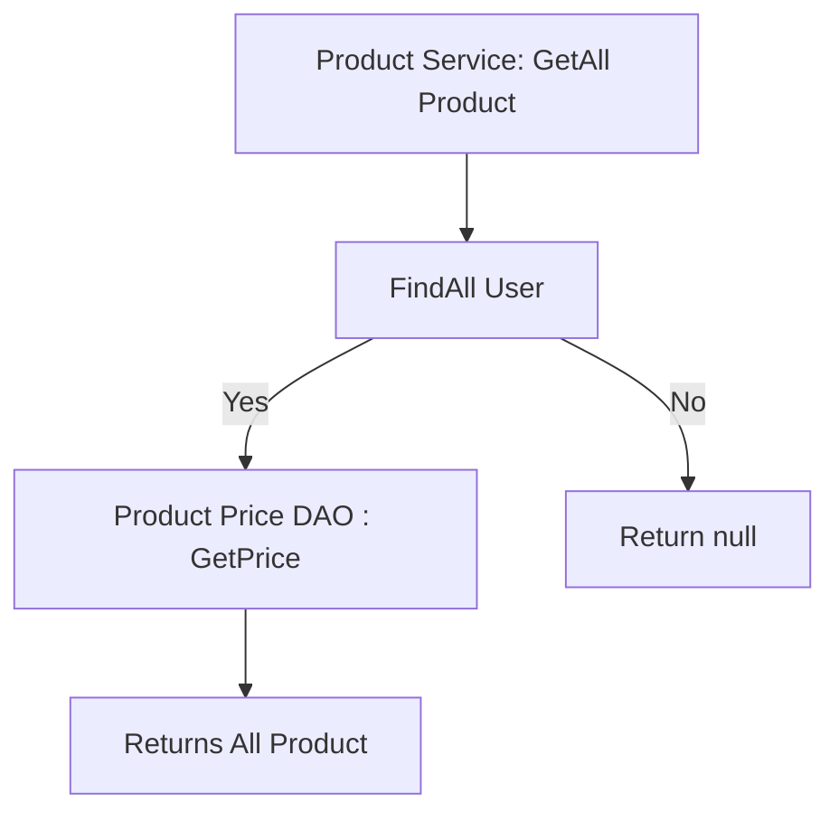
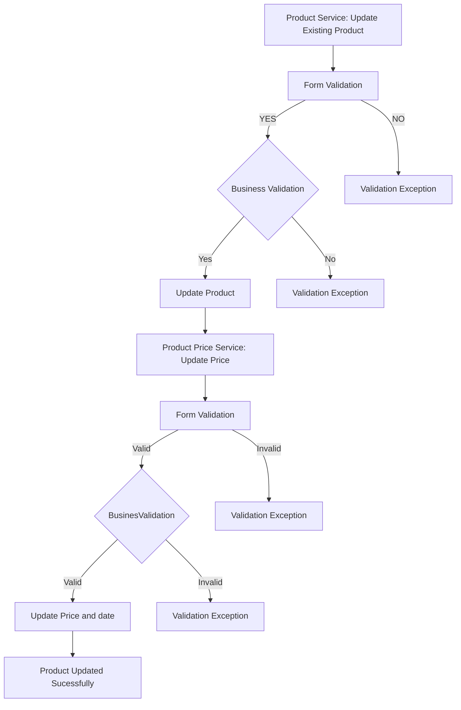
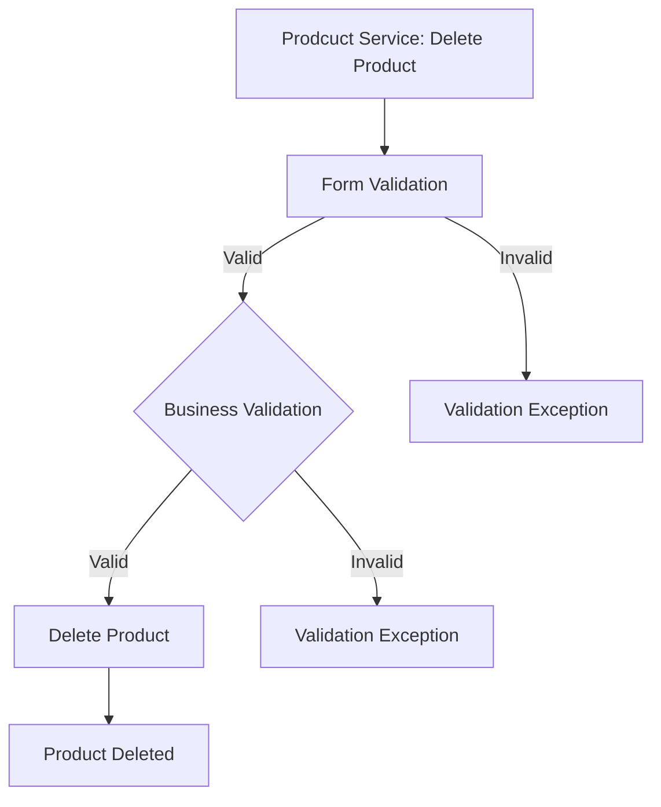
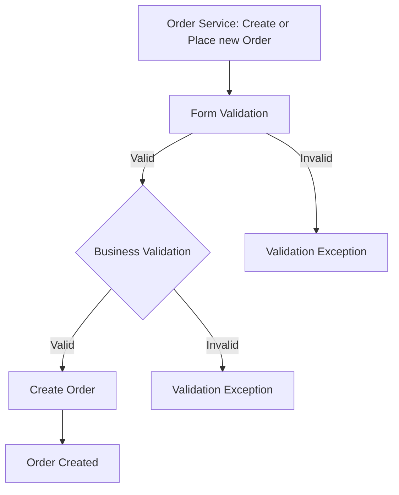

# Only Home Food

## Database Design

- [ ] Create an ER diagram of the database
- [ ] Write Create table scripts [script](/src/main/resources/db/migration/V1__create_users.sql)
- [ ] [ ER DIAGRAM](https://freeimage.host/i/HbqqXef)

## Project Setup

- [ ] Create a new Java project
- [ ] Set up a MySQL database
- [ ] Add necessary libraries
	- [ ] JDBC, 
	- [ ] MySQL Connector, 
	- [ ] JUnit, 
	- [ ] Dotenv

## Module: User

- [ ] Create User table
- [ ] Create User model

### Feature 1: Create User

#### User Story:
User can create his new account

#### Pre-requisites:

- [ ] User DAO (create) 
- [ ] User Service (create)

#### Validations:

- [ ] Form Validation
		- user null
		- name (null, empty, pattern)
		- email  (null, empty, pattern)
		- password  (null, empty, pattern)
		- phone_number (length >= 60000000001 and length <= 9999999999)

- [ ] Business Validation
		- phone_number or Email Already Exist

#### Messages:
- [ ] User cannot be null
- [ ] Name cannot be null or empty
- [ ] Email cannot be null or empty
- [ ] Password cannot be null or empty
- [ ] Invalid Email Id
- [ ] Mobile Number must start between 6 - 9 and have 10 digits
- [ ] Invalid String Pattern
- [ ] Password does not match the requested pattern
- [ ] User already exist

#### Flow: 


### Feature 2: Update User

#### User Story
Existing User can update his details

#### Pre-requisites:

- [ ] User DAO (update) 
- [ ] User Service (update)

#### Validations:

- [ ] Form Validation
		- id <= 0
		- User null
		- name (null, empty, pattern)
		- password  (null, empty, pattern)

- [ ] Business Validation
		- Check Id is present
	
#### Messages:
- [ ] User cannot be null
- [ ] Name cannot be null or empty
- [ ] password cannot be null or empty
- [ ] User Id cannot be zero or below zero
- [ ] Invalid String Pattern
- [ ] Password does not match the requested pattern
- [ ] User not found

#### Flow: 


### Feature 3: Delete User

#### User Story
User can inactive his account

#### Pre-requisites:

- [ ] User DAO (delete) 
- [ ] User Service (delete)

#### Validations:

- [ ] Form Validation
		- id <= 0
		- is active = 0

- [ ] Business Validation
		- Check Id is present

#### Messages:
- [ ] User Id cannot be zero or below zero
- [ ] User not found

#### Flow: 



## Module: Products

- [ ] Create Product table
- [ ] Create Product Price table
- [ ] Create Product model
- [ ] Create Product Price model

### Feature 1: Create Product

Create new Product

#### Pre-requisites:

- [ ] Product DAO (create) 
- [ ] Product Price DAO (create)
- [ ] Product Price Service (create)
- [ ] Product Service (create)

#### Validations:

- [ ] Form Validation
		- product null
		- name (null, empty, pattern)
		- food_type (null, empty, pattern)
		- quantity_type (null, empty, pattern)
		- price <= 0 and price >= 1000
		- quantity<= 0 and quantity>= 1000
		- id <=0

- [ ] Business Validation
		- Check Food name already exist
		- Check Product Id already exist

#### Messages:

- [ ] Product cannot be null
- [ ] Name cannot be null or empty
- [ ] Food type cannot be null or empty
- [ ] Quantity type cannot be null or empty
- [ ] Price cannot be zero or below zero
- [ ] Quantity cannot be zero or below zero
- [ ] Set Price range between 1 and 1000
- [ ] Set Quantity range between 1 and 1000
- [ ] Invalid String Pattern
- [ ] Product already exist

#### Flow: 


### Feature 2:  List All Products

#### Pre-requisites:
- [ ] Product Service(getAll)
- [ ] Product Price DAO(getPrices)
- [ ] Product DAO(findAll)

#### Flow: 


### Feature 3: Update Product

#### Pre-requisites:

- [ ] Product DAO (update) 
- [ ] Product Service (update)
- [ ] Product Price Service (update)

#### Validations:

- [ ] Form Validation
		- product null
		- id <= 0
		- name (null, empty, pattern)
		- food_type (null, empty, pattern)
		- quantity_type (null, empty, pattern)
		- price <= 0 and price >= 1000
		- quantity<= 0 and quantity>= 1000

- [ ] Business Validation
		- Check product Id is present
	
#### Messages:
- [ ] Product cannot be null
- [ ] Food type cannot be null or empty
- [ ] Quantity type cannot be null or empty
- [ ] Product Id cannot be zero or below zero
- [ ] Price cannot be zero or below zero
- [ ] Quantity cannot be zero or below zero
- [ ] Set Price range between 1 and 1000
- [ ] Set Quantity range between 1 and 1000
- [ ] Invalid String Pattern
- [ ] Product already exist

#### Flow: 


### Feature 4: Delete Product

#### Pre-requisites:

- [ ] Product DAO (delete) 
- [ ] Product Service (delete)

#### Validations:

- [ ] Form Validation
		- id <= 0
		- is active = 0

- [ ] Business Validation
		- Check product id is present

#### Messages:
- [ ] Product Id cannot be zero or below zero
- [ ] Product not found

#### Flow: 


## Module: Order

- [ ] Create Order table
- [ ] Create Order model

### Feature 1: Create Order

#### Pre-requisites:

- [ ] Order DAO (create) 
- [ ] Order Service (create)

#### Validations:

- [ ] Form Validation
	-Order null
	-address (null, empty, pattern)
	-quantity <=0
	-product id <=0
	-created by <= 0
	-total price <=0
	-quantity >= 10 

- [ ] Business Validation
		- Check Product Id is present
		- Check delivery time(Breakfast, lunch, dinner) is filled

#### Messages:
- [ ] Order cannot be null or empty
- [ ] Address cannot be null or empty
- [ ] Quantity cannot be zero or below zero
- [ ] Total Price cannot be zero or below zero
- [ ] User Id cannot be zero or below zero
- [ ] Product Id cannot be zero or below zero
- [ ] Quantity must be below 10
- [ ] Product not found
- [ ] User not found
- [ ] Invalid Address Pattern
		
#### Flow: 


### Feature 2:  List All Orders

#### Pre-requisites:
- [ ] Order Service(getAll)
- [ ] Order DAO(findAll)
		

#### Flow: 
```mermaid
graph TD;
  A["Order Service: GetAll Orders"] --> B[ FindAll Order]
  B -- Yes --> C["Return all Orders"]
  B -- No --> D["Return null"]
  ```
