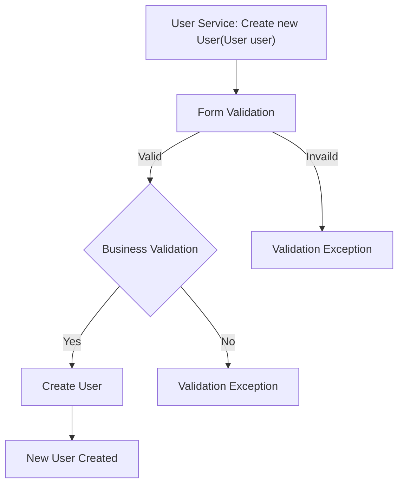
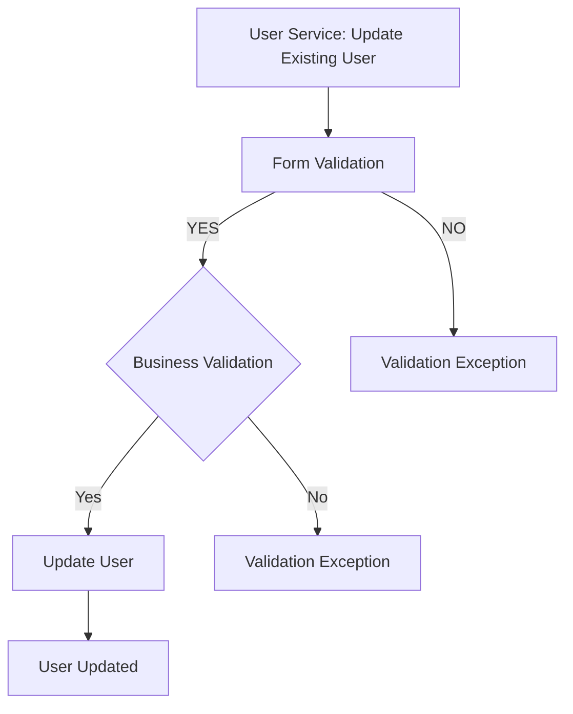
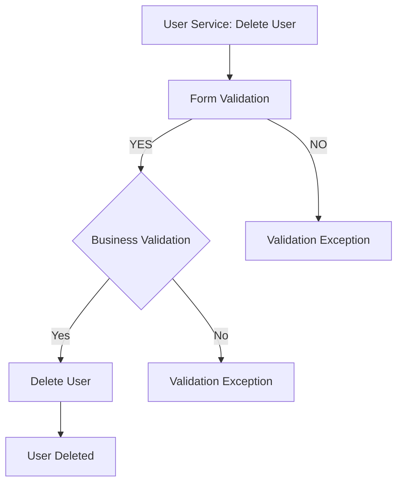
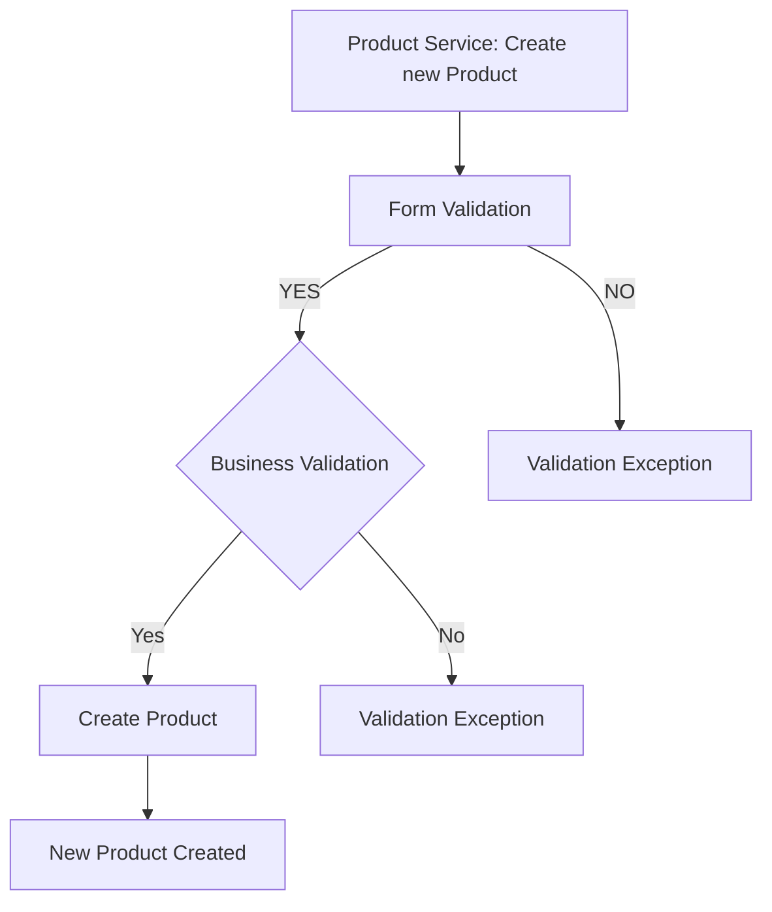
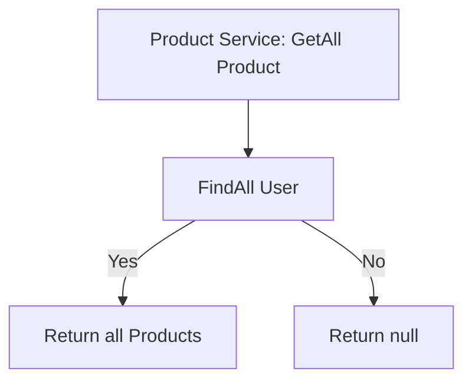
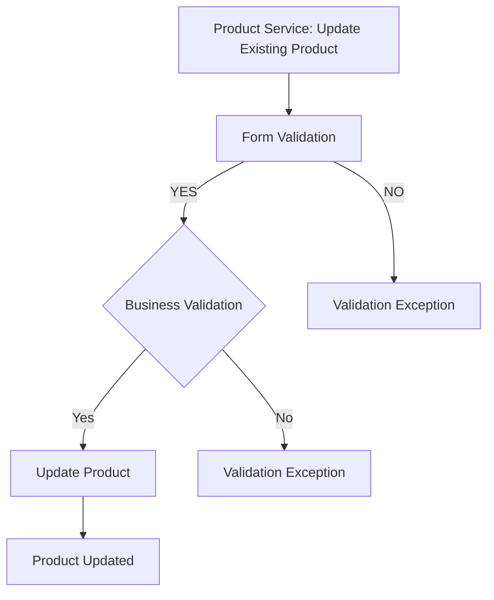
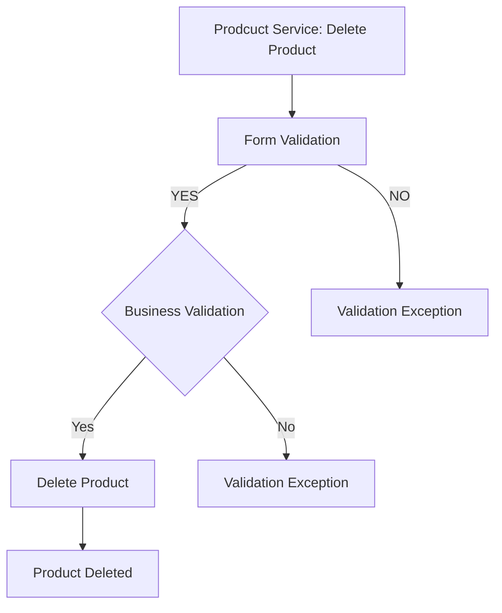
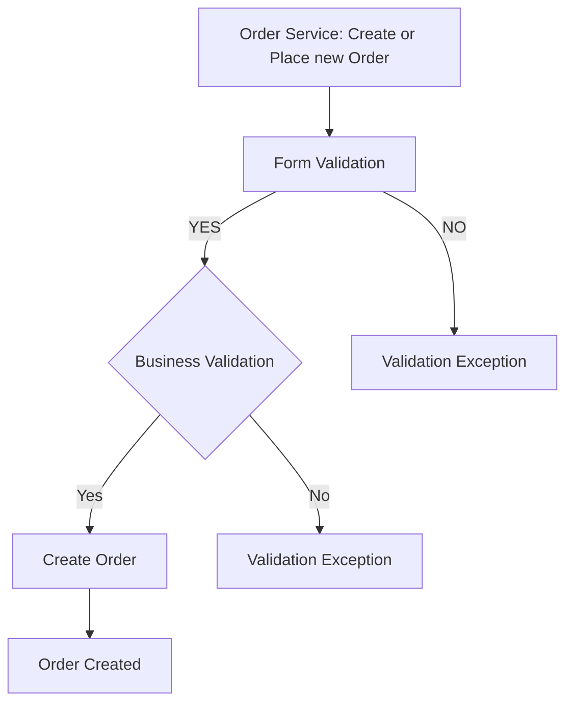

# Only Home Food

## Database Design

- [ ] Create an ER diagram of the database
- [ ] Write Create table scripts [script] (/src/main/resources/db/migration/V1__create_users.sql)

[ER Diagram](path/to/ER/diagram)

## Project Setup

- [ ] Create a new Java project
- [ ] Set up a MySQL database
- [ ] Add necessary libraries
	- [ ] JDBC, 
	- [ ] MySQL Connector, 
	- [ ] JUnit, 
	- [ ] Dotenv

## Module: User

- [ ] Create User table
- [ ] Create User model

### Feature 1: Create User

#### Pre-requisites:

- [ ] user DAO (create) 
- [ ] user Service (create)

#### Validations:

- [ ] Form Validation
		- user null
		- user_name null or empty
		- email null or empty
		- password null or empty
		- phone_number (length >= 60000000001 and length <= 9999999999)

- [ ] Business Validation
		- phone_number (check)

#### Messages:
- [ ] User cannot be null
- [ ] Name cannot be null or empty
- [ ] email cannot be null or empty
- [ ] password cannot be null or empty
- [ ] Invalid email Id
- [ ] Invalid phone number (Number must start between 6 - 9)
- [ ] Password does not match the requested pattern
- [ ] Phone number already exist

#### Flow: 


### Feature 2: Update User

#### Pre-requisites:

- [ ] user DAO (update) 
- [ ] user Service (update)

#### Validations:

- [ ] Form Validation
		- user null
		- id <= 0
		- user_name null or empty
		- password null or empty

- [ ] Business Validation
		- Check Id is present
	
#### Messages:
- [ ] User cannot be null
- [ ] Name cannot be null or empty
- [ ] password cannot be null or empty
- [ ] Password does not match the requested pattern
- [ ] User not found check the given id

#### Flow: 


### Feature 3: Delete User

#### Pre-requisites:

- [ ] user DAO (delete) 
- [ ] user Service (delete)

#### Validations:

- [ ] Form Validation
		- id <= 0
		- is_active = 0

- [ ] Business Validation
		- Check Id is present

#### Messages:
- [ ] Invalid Id
- [ ] User not found check the given id

#### Flow: 



## Module: Products

- [ ] Create Product table
- [ ] Create ProductPrice table
- [ ] Create Product model

### Feature 1: Create Product

#### Pre-requisites:

- [ ] product DAO (create) 
- [ ] product Service (create)

#### Validations:

- [ ] Form Validation
		- product null
		- food_name null or empty
		- food_type null or empty
		- description null or empty
		- price <= 0 and price >= 1000

- [ ] Business Validation
		- Food Name(check)

#### Messages:

- [ ] Product cannot be null
- [ ] Name cannot be null or empty
- [ ] Food type cannot be null or empty
- [ ] Description cannot be null or empty
- [ ] Price should be between 1 and 999
- [ ] Product already found check the name

#### Flow: 


### Feature 2:  List All Products

#### Pre-requisites:
- [ ] Product Service(getAll)
- [ ] Product DAO(findAll)

#### Flow: 


### Feature 3: Update Product

#### Pre-requisites:

- [ ] product DAO (update) 
- [ ] product Service (update)

#### Validations:

- [ ] Form Validation
		- product null
		- id <= 0
		- food_name null or empty
		- food_name null or empty
		- description null or empty
		- price <= 0 and price >= 1000

- [ ] Business Validation
		- Check product Id is present
	
#### Messages:
- [ ] Product cannot be null
- [ ] Name cannot be null or empty
- [ ] Food type cannot be null or empty
- [ ] Description cannot be null or empty
- [ ] Price should be between 1 and 999
- [ ] Product not found check the given Id

#### Flow: 


### Feature 4: Delete Product

#### Pre-requisites:

- [ ] product DAO (delete) 
- [ ] product Service (delete)

#### Validations:

- [ ] Form Validation
		- id <= 0
		- is_active = 0

- [ ] Business Validation
		- Check product id is present

#### Messages:
- [ ] Invalid Id
- [ ] User not found check the given id

#### Flow: 


## Module: Order

- [ ] Create Order table
- [ ] Create Order model

### Feature 1: Create Order

#### Pre-requisites:

- [ ] order DAO (create) 
- [ ] order Service (create)

#### Validations:

- [ ] Form Validation
	-Order null
	-address (null or empty string)
	-quantity <=0
	-created_by <= 0

- [ ] Business Validation
		- Check delivery_time(Breakfast, lunch, dinner) is filled

#### Messages:
- [ ] Order cannot be null or empty
- [ ] Address cannot be null or empty
- [ ] Please select the quantity
- [ ] User not found
- [ ] Choose your delivery time
		
#### Flow: 


### Feature 2:  List All Orders

#### Pre-requisites:
- [ ] Order Service(getAll)
- [ ] Order DAO(findAll)
		

#### Flow: 
```mermaid
graph TD;
  A["Order Service: GetAll Orders"] --> B[ FindAll Order]
  B -- Yes --> C["Return all Orders"]
  B -- No --> D["Return null"]
 
